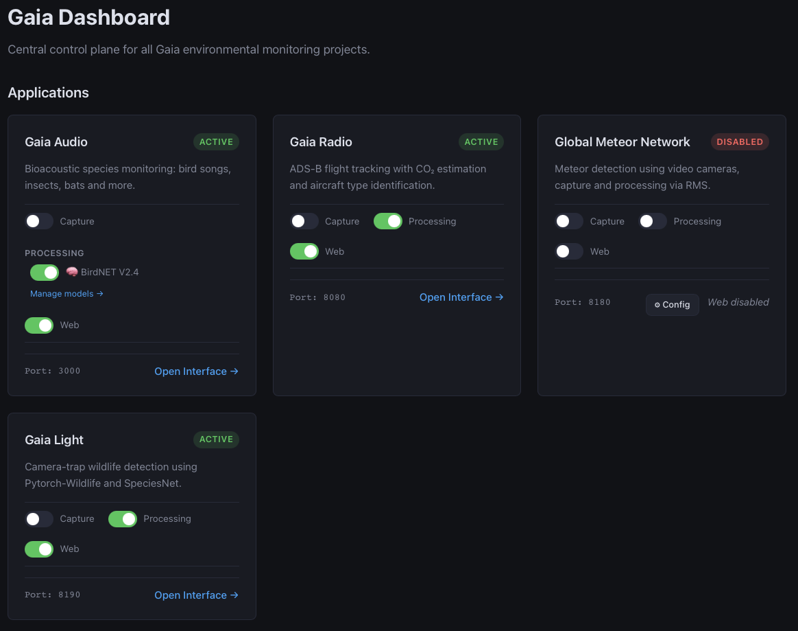
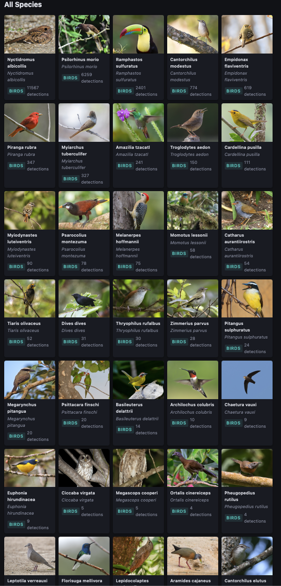

# Gaia

Gaia is a project for capturing different type of sources and processing them, typically the capture would happen in SBC type hardware like a Raspberry Pi with USB devices connected to it, and separate hardware would be in charge of processing but it could also be just one SBC doing the capture, processing and presenting (web interface).

The project will start with an easy to use web interface, were you select the roles for the hardware, use mDNS to detect other capture and processing nodes, and presenting using a web interface. This initial web interface would also be a wizard to create and modify configuration files for each of the participating projects.

All of the components will be packaged into containers by each of the participating projects, and the Gaia core itself will be a container.

## Demo

This would be on a processing node.




## Projects

### Global Meteor Network

The RMS from GMN is packaged in a [container](https://hub.docker.com/r/fede2/rms), but instead of using a graphical interface to view the webcam, create the masks for areas to avoid and to run the initial star solving, all of these plus the creation of a config file will be handled by the Gaia core contaier, if GMN is chosen as a project to install.

The RMS will be the capture container, having the posibility of running multiple SBC type hardware, each with one or multiple cameras. If multiple cameras are used, each will run it's own capture container.

For now the RMS container does both the capture and processing of the videos, but in the future we will try to split this functionality.

This is the [source branch](https://github.com/fede2cr/RMS/tree/container) for the RMS container for running Global Meteor Network.

### Gaia audio

This is a do-over of the BirdNetPi which will use one or multiple microphones to capture and process birdsongs as well as insect sounds, bat sounds, primate sounds and others.

These are the containers for it. https://hub.docker.com/r/fede2/gaia-capture, https://hub.docker.com/r/fede2/gaia-web and https://hub.docker.com/r/fede2/gaia-processing with source here https://github.com/fede2cr/gaia-audio




### Gaia radio

This project uses an SDR to listen to ADS-B and other sources of aircraft telemetry to graph passing airplanes that will not only make it easier for GMN processing nodes to mark at planes and con-trails, but also estimate the CO2 of each of the detected planes based on the average of fuel per km of each aircraft type.

So far this project is using the correct implementation to have multiple nodes detecting each other over mDNS, so the other projects should copy this approach and use it as a base for their own implementations.

These are the containers for the project. https://hub.docker.com/r/fede2/gaia-radio-processing https://hub.docker.com/r/fede2/gaia-radio-web https://hub.docker.com/r/fede2/gaia-radio-capture and this the sources in GitHub https://github.com/fede2cr/gaia-radio

## Host Setup

Some features require one-time host-level configuration that cannot be applied from inside a rootless container. A setup script is provided:

```bash
sudo bash setup-host.sh
```

### Camera access (V4L2)

The GMN camera pre-alignment feature needs access to `/dev/video*` devices from inside a rootless Podman container. By default the kernel's cgroup device controller blocks access to V4L2 devices (character major 81) regardless of UID/GID mapping or `--privileged` flags.

The host setup script installs a udev rule (`host/udev/99-gaia-video.rules`) that sets video device nodes to mode `0666`, allowing the container to open them. You can also install it manually:

```bash
sudo cp host/udev/99-gaia-video.rules /etc/udev/rules.d/
sudo udevadm control --reload-rules
sudo udevadm trigger
```

Verify with `ls -l /dev/video0`, permissions should show `crw-rw-rw-`.
